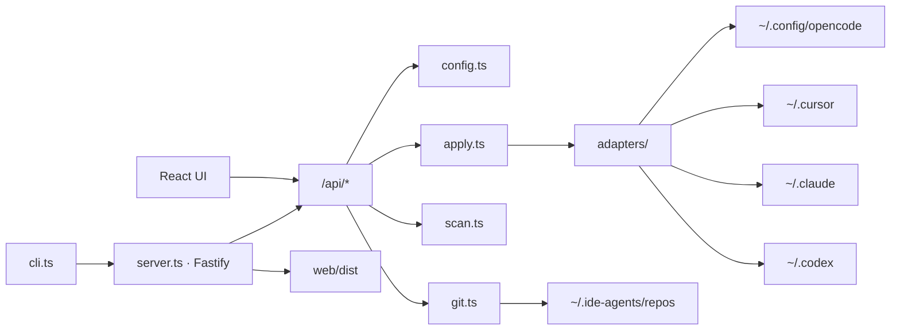

# Architecture

ide-agents is a single npm package with three layers: **CLI**, **HTTP API**, and **Web UI**.



## Repository layout

```
ide-agents/           # npm package (GitHub repo folder may differ)
├── src/              # Backend + CLI (TypeScript → dist/)
│   ├── shared/
│   │   └── api-types.ts  # Wire contract shared with web (`import type` only)
│   ├── cli.ts        # Entry: start server, open browser
│   ├── server.ts     # Fastify routes + static files
│   ├── config.ts     # ~/.ide-agents/config.json
│   ├── ides.ts       # default IDE detection, migration
│   ├── git.ts        # clone, fetch, pull, status
│   ├── scan.ts       # artifact discovery, layout detection, frontmatter
│   ├── apply.ts      # symlink management + project .gitignore
│   ├── gitignore.ts  # managed .gitignore entries
│   ├── template.ts   # bootstrap empty repos from template/
│   ├── targets.ts    # path blocking checks
│   ├── paths.ts      # home, repo paths, tilde expansion
│   ├── npmUpdate.ts  # npm registry version check (cached)
│   ├── version.ts    # package version for API
│   └── adapters/     # per-IDE path mapping
├── template/         # Starter catalog (shipped in npm package)
│   ├── skills/
│   └── agents/
├── web/              # Vite + React + Mantine
│   └── src/
│       ├── pages/    # Settings, Repositories, Skills, Agents
│       └── components/
└── docs/             # This Docusaurus site
```

## Runtime modes

### Production

```bash
npm run build   # tsc + vite build
ide-agents      # node dist/cli.js
```

One process serves both the API and the built React app from `web/dist`.

If the configured port (default **3921**) is busy, the CLI picks the next free port (up to nine attempts).

### Development

```bash
npm run dev
```

- Backend: `tsx watch src/cli.ts --no-open` on port **3921**
- Frontend: Vite on port **5173** with `/api` proxy to backend

## IDE adapters

Enabled tools come from [Settings](/docs/settings) (`config.ides`). `apply.ts` runs each enabled adapter for every installation.

| IDE | Config path (default) | Project subfolder |
|-----|------------------------|-----------------|
| OpenCode | `~/.config/opencode` | `.opencode` |
| Cursor | `~/.cursor` | `.cursor` |
| Claude | `~/.claude` | `.claude` |
| Codex | `~/.codex` | `.agents` |

Global targets: `{configPath}/skills/<name>` and `{configPath}/agents/<name>.md`.

For **bucketed** catalogs (e.g. [openai/skills](https://github.com/openai/skills)), the symlink name is the innermost skill id (`gh-fix-ci`), while `sourcePath` keeps the bucket path (`skills/.curated/gh-fix-ci`).

## Skill layout detection

`scan.ts` auto-detects how skills are organized in a clone:

1. **Nested** — `skills/<id>/SKILL.md` (default starter template)
2. **Bucketed** — `skills/<bucket>/<id>/SKILL.md`; on id collisions, `.curated` wins over `.experimental`, then other buckets, then `.system`
3. **Flat** — `<id>/SKILL.md` at repo root (e.g. cursorskills-style repos)

The detected value is exposed as `skillLayout` on repo cards and in API responses. Agents are always read from `agents/*.md`, independent of skill layout.

## Apply safety

When creating symlinks, ide-agents:

1. Creates parent directories if needed
2. Skips if symlink already points to the correct source (idempotent)
3. **Never** overwrites a regular file or directory — returns an error instead
4. On deactivation, removes symlinks only (never touches non-symlink targets)

## Project gitignore

For **project** installs inside a git repository, `apply.ts` adds symlink paths to `.gitignore` under a managed block:

```
# ide-agents (managed — do not edit manually)
.cursor/skills/my-skill
```

Entries are removed when the project install is deactivated. Non-git project roots are skipped.

## Empty-repo bootstrap

When a cloned repository has no skills or agents (only GitHub init files like `README.md`), `template.ts` copies the bundled `template/` catalog into the clone. On `POST /api/repos`, this runs automatically; for an already-cloned empty repo, use **Add starter template** in the UI or `POST /api/repos/:id/bootstrap`.

If the remote allows push, ide-agents commits and pushes the bootstrap (`chore: bootstrap skills catalog from ide-agents template`).

## Data on disk

```
~/.ide-agents/
├── config.json       # repos, installations, ides
└── repos/
    └── <slug>/       # git working copy
        ├── skills/
        └── agents/
```

Legacy data in `~/.agentdesk/` is renamed to `~/.ide-agents/` on first run.

The CLI records `launchCwd` at startup and exposes it as `defaultProjectPath` in `/api/status` for the UI (read-only project install path).
